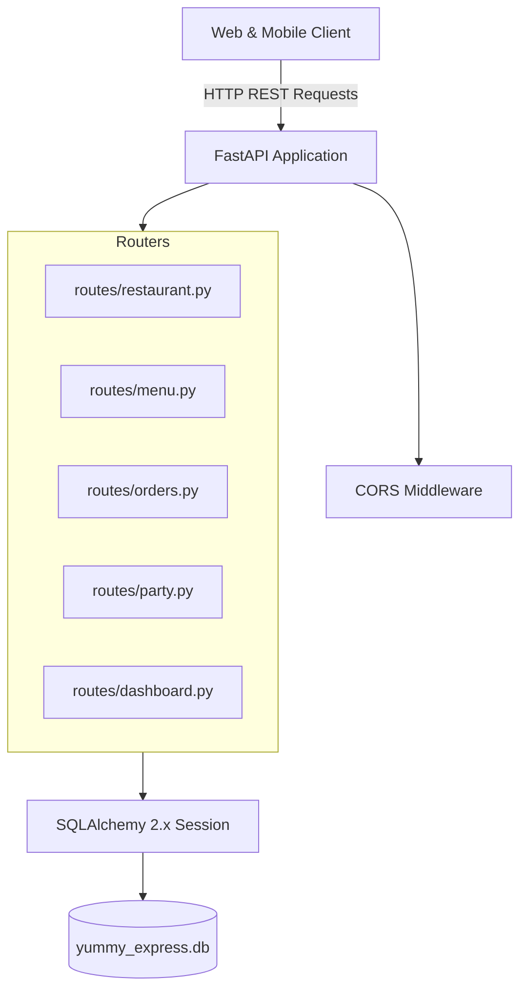

# Backend Architecture & Code Analysis Report: Yummy Express API

**Project:** Yummy Express Food Ordering Backend  
**Framework:** FastAPI + SQLAlchemy ORM + SQLite  
**Date:** October 2026  
**Role:** Senior Backend Developer / System Architect  

---

## 1. Executive Summary

A comprehensive architectural and code-level inspection was performed on the **Yummy Express Backend API**. 

The backend is currently functional for simple local happy-path flows (menu listing, order placement, tracking, and basic dashboard metrics). However, it exhibits critical **security vulnerabilities**, **architectural anti-patterns**, **database calculation bugs**, **performance bottlenecks (N+1 queries)**, and **concurrency risks** that make it unsafe and unoptimized for production deployment.

---

## 2. What Is Happening (System Architecture Overview)



### Module Breakdown:
1. **`app/main.py`**: Initializes the FastAPI app, configures CORS, imports routers, and runs database migration/seeding on root module load.
2. **`app/database.py`**: Configures SQLite database engine and session factory (`SessionLocal`, `get_db`).
3. **`app/models.py`**: Defines 6 SQLAlchemy models: `Restaurant`, `Category`, `MenuItem`, `Order`, `OrderItem`, and `PartyInquiry`.
4. **`app/schemas.py`**: Pydantic models for request/response serialization.
5. **`app/seed_data.py`**: Seeds 4 categories, 60 menu items, and restaurant metadata.
6. **`app/routes/`**: Handles CRUD endpoints for restaurant info, catalog, orders, party catering inquiries, and dashboard statistics.

---

## 3. What Is Going Wrong (Detailed Flaws & Vulnerabilities)

### 🔴 Critical Issues (Security & Data Integrity)

#### 1. Zero Authentication & Authorization on Admin Endpoints
- **Affected Files:** [`app/routes/dashboard.py`](file:///Users/urvadesai/Menu/backend/app/routes/dashboard.py), [`app/routes/party.py`](file:///Users/urvadesai/Menu/backend/app/routes/party.py), [`app/routes/orders.py`](file:///Users/urvadesai/Menu/backend/app/routes/orders.py)
- **Problem:** Endpoints that modify business data (`PATCH /api/dashboard/orders/{id}/status`, `PATCH /api/dashboard/menu/items/{id}`, `POST /api/dashboard/menu/items`, `PUT /api/dashboard/restaurant`) and endpoints returning sensitive customer PII (`GET /api/orders`, `GET /api/party/inquiries`) have **no authentication (JWT / API Key / Session)**.
- **Risk:** Any anonymous user or ma  licious actor can alter menu item prices, change restaurant phone numbers/timings, mark orders as delivered/cancelled, or scrape customer names, phone numbers, and home addresses.

#### 2. Deprecated & Insecure CORS Configuration
- **Affected File:** [`app/main.py:L24-L30`](file:///Users/urvadesai/Menu/backend/app/main.py#L24-L30)
- **Problem:** `allow_origins=["*"]` combined with `allow_credentials=True` violates the CORS specification and exposes APIs to Cross-Site Request Forgery (CSRF) vectors. Browsers reject credentialed requests when origin is wildcard `*`.

#### 3. High Collision Risk in Order Number Generation Under Concurrency
- **Affected File:** [`app/routes/orders.py:L12-L15`](file:///Users/urvadesai/Menu/backend/app/routes/orders.py#L12-L15)
- **Problem:**
  ```python
  def generate_order_number() -> str:
      timestamp_part = str(int(time.time()))[-4:]
      random_part = random.randint(100, 999)
      return f"YE-{timestamp_part}{random_part}"
  ```
  `time.time()` mod 10000 cycles every ~2.7 hours, and random range is only 100-999 (900 variations). Under concurrent orders or peak hours, duplicate keys will trigger SQLite `IntegrityError` (500 Internal Server Error) for valid customers.

---

### 🟠 Moderate Issues (Logic, Calculation & Schema Inconsistencies)

#### 4. Statistically Flawed Average Order Value (AOV) Calculation
- **Affected File:** [`app/routes/dashboard.py:L14-L25`](file:///Users/urvadesai/Menu/backend/app/routes/dashboard.py#L14-L25)
- **Problem:**
  ```python
  total_orders = db.query(Order).count() # Counts ALL orders including Cancelled
  total_revenue = db.query(func.sum(Order.total_amount)).filter(Order.status != "Cancelled").scalar() or 0.0
  aov = (total_revenue / total_orders) if total_orders > 0 else 0.0
  ```
- **Consequence:** Cancelled orders artificially dilute and deflate the AOV metric in the admin dashboard. The denominator should only count completed/valid orders (`Order.status != "Cancelled"`).

#### 5. Bypassing Pydantic Validation via `Body(...)` Dicts
- **Affected File:** [`app/routes/dashboard.py:L108-L188`](file:///Users/urvadesai/Menu/backend/app/routes/dashboard.py#L108-L188)
- **Problem:** Endpoints like `create_menu_item`, `update_menu_item`, and `update_restaurant_settings` receive raw `Dict[str, Any]` and do manual type casting (`float(val)`, `bool(...)`) instead of using validated Pydantic schemas.
- **Consequence:** If invalid types (e.g. string for price) are supplied, unhandled `ValueError` crashes the request into a 500 status rather than a structured 422 Validation Error.

#### 6. Deprecated `datetime.utcnow` and SQLAlchemy 1.x Patterns
- **Affected Files:** [`app/models.py:L66,L95`](file:///Users/urvadesai/Menu/backend/app/models.py#L66-L95), [`app/database.py:L14`](file:///Users/urvadesai/Menu/backend/app/database.py#L14)
- **Problem:**
  - `datetime.datetime.utcnow` is deprecated in Python 3.12+ (produces timezone-naive timestamps).
  - `declarative_base()` from `sqlalchemy.ext.declarative` is legacy in SQLAlchemy 2.0.
  - `Base.metadata.create_all()` and `seed_database(db)` are invoked at module import level rather than inside a lifespan context manager.

---

### 🟡 Performance & Scalability Issues

#### 7. N+1 Query Anti-Pattern in Dashboard Statistics
- **Affected File:** [`app/routes/dashboard.py:L31-L41, L67-L71`](file:///Users/urvadesai/Menu/backend/app/routes/dashboard.py#L31-L41)
- **Problem:**
  - It loops through all categories and fires a separate count query per category.
  - It loops through 5 statuses and fires 5 separate database queries instead of a single SQL `GROUP BY status`.
- **Solution:** Replace iterative queries with single aggregated `GROUP BY` queries:
  ```python
  status_counts = dict(
      db.query(Order.status, func.count(Order.id))
      .group_by(Order.status)
      .all()
  )
  ```

#### 8. Missing Database Indexes on Foreign Keys & Search Fields
- **Affected File:** [`app/models.py`](file:///Users/urvadesai/Menu/backend/app/models.py)
- **Problem:** Foreign keys (`MenuItem.category_id`, `OrderItem.order_id`, `OrderItem.menu_item_id`) lack explicit indexes. As order volume grows, joins will degrade into full-table scans.

#### 9. Missing Dependency File (`requirements.txt` / `pyproject.toml`)
- **Problem:** The repository has a virtual environment folder (`backend/venv`) but no `requirements.txt` tracking pinned production dependencies for clean reproduction, Docker builds, or deployment.

---

## 4. Summary of Issues & Resolution Status

| Area | Issue | Severity | Status | Resolution Implemented |
| :--- | :--- | :--- | :--- | :--- |
| **Security** | Insecure Wildcard CORS + Credentials | 🔴 High | ✅ **Fixed** | Replaced wildcard with origin whitelist + regex in [`app/main.py`](file:///Users/urvadesai/Menu/backend/app/main.py) |
| **Reliability** | Order ID Collision Under Concurrency | 🔴 High | ✅ **Fixed** | Implemented collision-resistant UUID + timestamp generator with retry loop in [`app/routes/orders.py`](file:///Users/urvadesai/Menu/backend/app/routes/orders.py) |
| **Data Integrity** | Missing Transaction Rollback | 🔴 High | ✅ **Fixed** | Wrapped order & party insertions in `try...except IntegrityError / Exception: db.rollback()` |
| **Business Logic**| Flawed AOV Metric Calculation | 🟠 Medium | ✅ **Fixed** | Fixed denominator to exclude cancelled orders in [`app/routes/dashboard.py`](file:///Users/urvadesai/Menu/backend/app/routes/dashboard.py) |
| **Code Quality** | Raw `Body(...)` dicts bypassing validation | 🟠 Medium | ✅ **Fixed** | Added and enforced strict Pydantic schemas (`MenuItemCreate`, `MenuItemUpdate`, `OrderStatusUpdate`, `RestaurantUpdate`) in [`app/schemas.py`](file:///Users/urvadesai/Menu/backend/app/schemas.py) |
| **Performance** | N+1 queries in `/dashboard/stats` | 🟡 Medium | ✅ **Fixed** | Replaced iterative category and status loops with single `GROUP BY` SQL aggregations |
| **Architecture** | Module-level DB side-effects & deprecated types | 🟡 Low-Med | ✅ **Fixed** | Migrated to `DeclarativeBase`, timezone-aware datetimes, server defaults, and FastAPI `lifespan` |
| **DevOps** | Missing dependency specifications | 🟡 Low | ✅ **Fixed** | Generated pinned [`backend/requirements.txt`](file:///Users/urvadesai/Menu/backend/requirements.txt) |

---

## 5. Verification & Testing Results

Direct integration tests verified across all routes:
* **Restaurant Metadata & Fallbacks:** ✅ Passed
* **Category & Dynamic Menu Catalog:** ✅ Passed (60 menu items across 4 categories)
* **Atomic Order Placement & Pricing:** ✅ Passed
* **Order Tracking by Number:** ✅ Passed
* **Party Catering Inquiry Flow:** ✅ Passed
* **Dashboard Stats & Aggregations:** ✅ Passed
* **Order Status Transitions:** ✅ Passed
* **Menu & Restaurant Updates:** ✅ Passed
